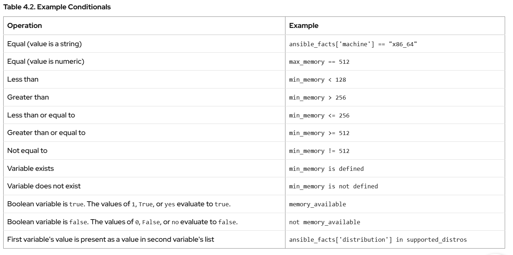

## Chapter 1.3 Installing Ansible

enable
```
[root@ansible1 ~]# vi /etc/yum.repos.d/redhat.repo 

[ansible-automation-platform-2.5-for-rhel-9-x86_64-rpms]
name = Red Hat Ansible Automation Platform 2.5 for RHEL 9 x86_64 (RPMs)
baseurl = https://cdn.redhat.com/content/dist/layered/rhel9/x86_64/ansible-automation-platform/2.5/os
enabled = 1
```
install ansible
```
dnf install ansible-navigator -y
```
check version
```
[root@ansible1 ~]# ansible-navigator --version
ansible-navigator 25.8.0

[root@ansible1 ~]# ansible --version
ansible [core 2.16.14]
  config file = /etc/ansible/ansible.cfg
  configured module search path = ['/root/.ansible/plugins/modules', '/usr/share/ansible/plugins/modules']
  ansible python module location = /usr/lib/python3.11/site-packages/ansible
  ansible collection location = /root/.ansible/collections:/usr/share/ansible/collections
  executable location = /usr/bin/ansible
  python version = 3.11.11 (main, Aug 21 2025, 00:00:00) [GCC 11.5.0 20240719 (Red Hat 11.5.0-5)] (/usr/bin/python3.11)
  jinja version = 3.1.6
  libyaml = True

```

## Chapter 2.  Implementing an Ansible Playbook

1. Khái niệm Inventory

Inventory là danh sách các host (máy chủ) mà Ansible quản lý.

2. Loại Inventory
- Static inventory: viết sẵn trong file text (định dạng INI hoặc YAML).
- Dynamic inventory: được sinh tự động bởi plugin (ví dụ lấy từ AWS, GCP...).

3. Static Inventory (INI-style)

Cấu trúc phổ biến:
```
[webservers]
web1.example.com
web2.example.com
192.0.2.42

[db-servers]
db1.example.com
db2.example.com
```
- Dòng trong ngoặc vuông [ ] là tên nhóm.
- Mỗi dòng sau đó là tên host hoặc IP.

🧩 4. Host có thể thuộc nhiều nhóm

Ví dụ:
```
[webservers]
web1.example.com
web2.example.com

[db-servers]
db1.example.com
db2.example.com

[east-datacenter]
web1.example.com
db1.example.com

[production]
web1.example.com
web2.example.com
db1.example.com
db2.example.com
```
5. Hai nhóm đặc biệt

- all → chứa mọi host trong inventory.
- ungrouped → chứa các host không nằm trong nhóm nào khác.

example
```
[all]
web1.example.com
web2.example.com
db1.example.com
db2.example.com
backup.example.com

[ungrouped]
backup.example.com
```

6. Nested Groups (Nhóm lồng nhau)

Dùng hậu tố `:children` để gom nhóm:
```
[usa]
washington1.example.com
washington2.example.com

[canada]
ontario01.example.com
ontario02.example.com

[north-america:children]
usa
canada
```

→ Nhóm `north-america` gồm tất cả host trong `usa` và `canada`.

7. Rút gọn tên host bằng Range

Giúp tiết kiệm thời gian khi có nhiều host tương tự nhau:
```
server[01:20].example.com   # server01 → server20
192.168.[4:7].[0:255]       # 192.168.4.0 → 192.168.7.255
[a:c].dns.example.com        # a, b, c.dns.example.com
```

Lưu ý: có thể dùng cả số và chữ cái. Nếu có số 0 ở đầu thì phải giữ nguyên khi gọi (server01 ≠ server1).

8. Kiểm tra Inventory

Dùng lệnh:
```
ansible-navigator inventory -i inventory -m stdout --list
```
example
```
{
    "all": {
        "children": ["dbservers", "ungrouped", "webservers"]
    },
    "dbservers": {
        "hosts": ["db1.example.com", "db2.example.com"]
    },
    "webservers": {
        "hosts": ["web1.example.com", "web2.example.com"]
    },
    "ungrouped": {
        "hosts": ["backup.example.com"]
    }
}
```

→ Liệt kê toàn bộ inventory (groups & hosts).
```
ansible-navigator inventory -i inventory
```
→ Giao diện điều hướng, có thể chọn “Browse Groups” hoặc “Browse Hosts”.

Example

Create file `inventory.ini`
```
[root@ansible1 ~]# mkdir test_ansible
[root@ansible1 ~]# cat test_ansible/inventory.ini 
[webservers]
localhost ansible_connection=local

[root@ansible1 test_ansible]# ansible-inventory -i inventory.ini --list
{
    "_meta": {
        "hostvars": {
            "localhost": {
                "ansible_connection": "local"
            }
        }
    },
    "all": {
        "children": [
            "ungrouped",
            "webservers"
        ]
    },
    "webservers": {
        "hosts": [
            "localhost"
        ]
    }
}

[root@ansible1 test_ansible]# ansible all -i /root/test_ansible/inventory.ini -m ping
localhost | SUCCESS => {
    "ansible_facts": {
        "discovered_interpreter_python": "/usr/bin/python3"
    },
    "changed": false,
    "ping": "pong"
}

# giao diện TUI (text-based UI), tạo file user-level:
[root@ansible1 ~]# cat  ~/.ansible-navigator.yml
---
ansible-navigator:
  execution-environment:
    enabled: false

[root@ansible1 ~]# ansible-navigator inventory -i /root/test_ansible/inventory.ini

```
- Browse groups (0) → duyệt các nhóm host trong inventory.
  - Ví dụ: [webservers], [dbservers], [ungrouped].
  -  có thể chọn một nhóm để xem host bên trong.
- Browse hosts (1) → duyệt tất cả các host.
  - Ví dụ: localhost, web1.example.com, …
  - Dễ kiểm tra host nào đang có trong inventory.

Cách sử dụng:
- Gõ 0 → Enter → xem danh sách nhóm → gõ số nhóm để mở.
- Gõ 1 → Enter → xem danh sách host → chọn host để xem biến (hostvars) nếu có.
- ESC → thoát menu.
> Đây là giao diện trực quan, giúp  kiểm tra inventory mà không cần lệnh JSON dài.


## 2.3 Managing Ansible Configuration Files

Cấu hình Ansible
 có thể tạo và chỉnh sửa hai tệp trong mỗi thư mục dự án Ansible để cấu hình hành vi của Ansible và lệnh `ansible-navigator`. Thư mục dự án Ansible là thư mục mà  chạy các playbook bằng cách sử dụng lệnh `ansible-navigator`.

- `ansible.cfg`, cấu hình hành vi của một số công cụ Ansible.
- `ansible-navigator.yml`, thay đổi các tùy chọn mặc định cho lệnh `ansible-navigator`.

```
[root@ansible1 ~]# vi /etc/ansible/ansible.cfg 
[root@ansible1 ~]# vi /etc/ansible-navigator/ansible-navigator.yml


# 10/29/2025
[root@ansible1 ~]# cat  /etc/ansible-navigator/ansible-navigator.yml
---
ansible-navigator:
  execution-environment:
    enabled: false
```

3. Kiểm tra cấu hình hiện tại
```
ansible-navigator config
```
time: 10/29/2025
```
 44│Default ask pass                                         True           default        False
 45│Default ask vault pass                                   True           default        False
 46│Default become                                           True           default        False
 47│Default become ask pass                                  True           default        False
 48│Default become exe                                       True           default        
 49│Default become flags                                     True           default        
 50│Default become method                                    True           default        
 51│Default become user                                      True           default        root 
 92│Default remote port                                      True           default        None
 93│Default remote user                                      True           default        None
```

| Vị trí file                             | Phạm vi ảnh hưởng                         | Khi nào nên dùng                                                                                                                 |
| --------------------------------------- | ----------------------------------------- | -------------------------------------------------------------------------------------------------------------------------------- |
| `/etc/ansible/ansible.cfg`              | Toàn hệ thống (mọi user, mọi project)     | Khi  muốn **toàn bộ hệ thống / team** dùng chung 1 cấu hình (ví dụ trong môi trường lab hoặc production có chuẩn thống nhất). |
| `~/.ansible.cfg`                        | Chỉ ảnh hưởng đến **user đó**             | Khi  muốn chỉ **mình ** dùng cấu hình này, không ảnh hưởng tới người khác.                                                 |
| `./ansible.cfg` (trong thư mục project) | Chỉ ảnh hưởng **project hiện tại**        | Thường dùng nhất trong thực tế — giúp mỗi project có cấu hình riêng (ví dụ user, become, inventory…).                          |
| Biến môi trường `ANSIBLE_CONFIG`        | Chỉ ảnh hưởng **phiên làm việc hiện tại** | Dùng tạm thời khi  muốn test 1 cấu hình khác mà không muốn sửa file thật.                                                     |

Cách Ansible “quyết” cấu hình (ưu tiên)  
ANSIBLE_CONFIG env → ./ansible.cfg (cwd) → ~/.ansible.cfg → /etc/ansible/ansible.cfg.
Vì vậy thay đổi cho project đặt trong ./ansible.cfg là an toàn, không ảnh hưởng toàn hệ thống.
## Managing Ansible Settings

Example
```
[root@ansible1 test_ansible]# ll
total 12
-rw-r--r--. 1 root root   91 Oct 29 15:34 ansible.cfg
-rw-r--r--. 1 root root 3313 Oct 29 15:20 ansible-navigator.log
-rw-r--r--. 1 root root  101 Oct 29 15:15 inventory.ini

[root@ansible1 test_ansible]# cat ansible.cfg 
[defaults]
inventory = ~/test_ansible/inventory.ini
remote_user = nghiahv
ask_pass = True

[root@ansible1 test_ansible]# cat inventory.ini 
[webserver]
#localhost ansible_connection=local
web1 ansible_host=192.168.38.31 ansible_user=nghiahv

[root@ansible1 test_ansible]# ansible webserver -m ping
SSH password: 
web1 | SUCCESS => {
    "ansible_facts": {
        "discovered_interpreter_python": "/usr/bin/python3"
    },
    "changed": false,
    "ping": "pong"
}
```


## 2.5 Writing and Running Playbooks

Executing a Dry Run
```
[root@ansible1 test_ansible]# ansible-navigator run -m stdout ping-myself.yml --check

PLAY [Ping test] ***************************************************************

TASK [Gathering Facts] *********************************************************
ok: [web1]

TASK [Ping remote host] ********************************************************
ok: [web1]

PLAY RECAP *********************************************************************
web1                       : ok=2    changed=0    unreachable=0    failed=0    skipped=0    rescued=0 
```
So sánh
```
$ ansible-navigator run ping-myself.yml -m stdout
$ ansible-navigator run ping-myself.yml
```

- `-m stdout`: Chạy Ansible Navigator ở chế độ stdout, tức là hiển thị kết quả trực tiếp ra terminal như khi dùng ansible-playbook. Không có giao diện tương tác.

- Không có `-m stdout`: Sử dụng chế độ mặc định là interactive mode, tức là có giao diện bán tương tác trong terminal, cho phép điều hướng qua các phần kết quả.

## 2.7 Implementing Multiple Plays

YAML Syntax

YAML Comments
```
# This is a YAML comment
hostname: server1  # This is also a YAML comment
```

YAML Strings
- Chuỗi không bắt buộc phải đặt trong dấu nháy.
- Có thể dùng ' hoặc " nếu chuỗi có ký tự đặc biệt hoặc khoảng trắng.
```
message: Hello world
message: 'Hello world'
message: "Hello world"
```

Chuỗi nhiều dòng
```
address: |
        Example Company
        123 Main Street
        Atlanta, GA 30303
```
Dùng > để gộp thành một dòng, bỏ xuống dòng:
```
fold_newlines: >
        This is an example
        of a long string,
        that will become
        a single sentence once folded.
```
→ Kết quả: "This is an example of a long string, that will become a single sentence once folded."

YAML Dictionaries (key-value)

Dạng khối
```
name: svcrole
svcservice: httpd
svcport: 80
```
Dạng dòng (inline):
```
{name: svcrole, svcservice: httpd, svcport: 80}
```

YAML Lists

Dạng khối
```
hosts:
  - servera
  - serverb
  - serverc
```
Dạng dòng (inline):

```
hosts: [servera, serverb, serverc]
```
Obsolete Playbook Shorthand

Dạng viết tắt
```
- name: Shorthand form
  ansible.builtin.service: name=httpd enabled=true state=started
```

Dạng chuẩn (nên dùng):
```
- name: Normal form
  ansible.builtin.service:
    name: httpd
    enabled: true
    state: started
```

# Chapter 3.  Managing Variables and Facts

Variables in Playbooks

Biến giúp bạn tái sử dụng giá trị trong nhiều task mà không phải viết lại. Ví dụ:

```
vars:
  web_package: httpd

tasks:
  - name: Install web package
    ansible.builtin.dnf:
      name: "{{ web_package }}"
      state: present
```
Defining Variables in Playbooks

Trong playbook (dùng vars):

```
- hosts: all
  vars:
    user: joe
    home: /home/joe
```
Trong file bên ngoài (dùng vars_files):

```
- hosts: all
  vars_files:
    - vars/users.yml

# File users.yml sẽ chứa:
user: joe
home: /home/joe
```

**Using Variables in Playbooks**
- Dùng dấu `{{ variable_name }}` để gọi biến

- Nếu biến nằm đầu dòng, phải đặt trong dấu nháy "{{ variable }}" để tránh lỗi YAML

Example
```
name: "{{ service }}"

# sai 
name: {{ service }}  # dễ gây lỗi
```

**Host Variables and Group Variables**

Defining the ansible_user host variable for demo.example.com:
```
[servers]
demo.example.com  ansible_user=joe
```
Group variable
```
[servers]
demo1.example.com
demo2.example.com

[servers:vars]
user=joe
```
Group gồm nhiều nhóm:
```
[servers1]
demo1.example.com
demo2.example.com

[servers2]
demo3.example.com
demo4.example.com

[servers:children]
servers1
servers2

[servers:vars]
user=joe
```

**Thư mục `host_vars` và `group_vars`**

```
project/
├── inventory
├── playbook.yml
├── group_vars/
│   ├── datacenter1
│   └── datacenter2
├── host_vars/
│   ├── demo1.example.com.yml
│   └── demo2.example.com.yml
```
Example
```
[admin@station project]$ cat ~/project/group_vars/datacenter1
package: httpd
[admin@station project]$ cat ~/project/group_vars/datacenter2
package: apache
```

Overriding Variables from the Command Line

```
[user@demo ~]$ ansible-navigator run main.yml -e "package=apache"
```

**Using Dictionaries as Variables**  
Thay vì:
```
user1_first_name: Bob
user1_last_name: Jones
```

Dùng:
```
users:
  bjones:
    first_name: Bob
    last_name: Jones
```

Goi bien
```
users.bjones.first_name

# or
users['bjones']['first_name']
```

**Capturing Command Output with Registered Variables**

Khái niệm ngắn gọn

- register là từ khóa của task dùng để lưu (ghi nhận) kết quả trả về của một module vào một biến.

- Biến này có thể được tái sử dụng ở các task sau để in ra (debug), rẽ nhánh (điều kiện when), lặp lại (until/retries), hay xử lý dữ liệu.

```
- name: Install package
  ansible.builtin.dnf:
    name: httpd
    state: installed
  register: install_result

- debug:
    var: install_result
```
When you run the play, the debug module dumps the value of the install_result registered variable to the terminal.

```
[user@demo ~]$ ansible-navigator run playbook.yml -m stdout
PLAY [Installs a package and prints the result] ****************************

TASK [setup] ***************************************************************
ok: [demo.example.com]

TASK [Install the package] *************************************************
ok: [demo.example.com]

TASK [debug] ***************************************************************
ok: [demo.example.com] => {
    "install_result": {
        "changed": false,
        "msg": "",
        "rc": 0,
        "results": [
            "httpd-2.4.51-7.el9_0.x86_64 providing httpd is already installed"
        ]
    }
}

PLAY RECAP *****************************************************************
demo.example.com    : ok=3    changed=0    unreachable=0    failed=0    skipped=0    rescued=0    ignored=0
```

## 3.3 Managing Secrets

Ansible Vault – công cụ giúp bạn mã hóa và bảo vệ dữ liệu nhạy cảm trong dự án Ansible


Tạo file được mã hóa
```
[root@ansible1 ~]# ansible-
ansible-builder      ansible-connection   ansible-doc          ansible-inventory    ansible-navigator    ansible-pull         ansible-runner-3     ansible-vault        
ansible-config       ansible-console      ansible-galaxy       ansible-lint         ansible-playbook     ansible-runner       ansible-runner-3.11  
[root@ansible1 ~]# ansible-vault create secret.yml
```

Xem nội dung file mã hóa
```
ansible-vault view secret.yml
```

Chỉnh sửa file mã hóa
```
ansible-vault edit secret.yml
```

Mã hóa file đã có
```
ansible-vault encrypt secret1.yml secret2.yml
```
- Mã hóa một hoặc nhiều file đã tồn tại.
- Dùng --output=newfile.yml để lưu ra file mới.

Giải mã file
```
ansible-vault decrypt secret1.yml --output=secret1-decrypted.yml
```

Đổi mật khẩu Vault
```
ansible-vault rekey secret.yml
```

Chạy playbook có file mã hóa

Nếu playbook dùng biến từ file Vault, bạn cần cung cấp mật khẩu:

```
ansible-navigator run site.yml --vault-id @prompt --pae false

ansible-navigator run site.yml --vault-password-file=vault-pass

export ANSIBLE_VAULT_PASSWORD_FILE=vault-pass

# Phải tắt playbook artifact (--pae false) nếu dùng @prompt, để tránh treo lệnh.
```

Dùng nhiều Vault password
```
ansible-navigator run site.yml \
  --vault-id one@prompt --vault-id two@prompt
```

**Quản lý biến nhạy cảm**

Cấu trúc thư mục khuyến nghị:
```
project/
├── ansible.cfg
├── inventory
├── playbook.yml
├── group_vars/
│   └── webservers/
│       └── vars
├── host_vars/
│   └── demo.example.com/
│       ├── vars
│       └── vault
```
- vars: biến thường (không mã hóa)
- vault: biến nhạy cảm (được mã hóa bằng Vault)

📌 Tên file trong host_vars và group_vars có thể tùy chọn.

## 3.5 Managing Facts

**Ansible Facts**

Facts là các biến hệ thống được Ansible tự động thu thập từ máy chủ được quản lý (managed host). Chúng chứa thông tin như:
- Tên host, địa chỉ IP, phiên bản kernel
- Dung lượng RAM, CPU, ổ đĩa
- Giao diện mạng, DNS, hệ điều hành
- Có thể tạo custom facts riêng

Thu thập Facts

- Module `ansible.builtin.setup` sẽ tự động chạy ở đầu mỗi play để thu thập facts.

- Dòng `TASK [Gathering Facts]` khi chạy playbook.

xem tất cả facts
```
- name: Fact dump
  hosts: all
  tasks:
    - name: Print all facts
      ansible.builtin.debug:
        var: ansible_facts
```
→ Chạy playbook này sẽ hiển thị toàn bộ facts dưới dạng dictionary JSON.

Một số facts phổ biến
```
Mô tả	|Biến
---|---
Tên host ngắn	|ansible_facts['hostname']
FQDN	|ansible_facts['fqdn']
IP chính	|ansible_facts['default_ipv4']['address']
Giao diện mạng|	ansible_facts['interfaces']
Dung lượng phân vùng	|ansible_facts['devices']['vda']['partitions']['vda1']['size']
DNS|	ansible_facts['dns']['nameservers']
Kernel	|ansible_facts['kernel']
```

Note: Có thể dùng `ansible_facts.default_ipv4.address` thay cho `['default_ipv4']['address']`


Tắt việc thu thập facts  
Nếu không cần facts, có thể tắt
```
- name: Không thu thập facts
  hosts: all
  gather_facts: false
```

Thu thập một phần facts

Chỉ lấy facts phần cứng:
```
- name: Chỉ lấy hardware facts
  ansible.builtin.setup:
    gather_subset:
      - hardware
```
Bỏ qua phần cứng:
```
- name: Bỏ qua hardware facts
  ansible.builtin.setup:
    gather_subset:
      - "!hardware"
```

**Magic Variables – Biến đặc biệt trong Ansible**

Magic variables là những biến tự động được Ansible tạo ra, không cần khai báo. Chúng cung cấp thông tin


Biến	|Ý nghĩa
---|---
hostvars	|Truy cập biến và facts của host khác trong inventory
group_names	|Danh sách các nhóm mà host hiện tại thuộc về
groups|	Danh sách tất cả các nhóm và host trong inventory
inventory_hostname	|Tên host như khai báo trong inventory (có thể khác với ansible_facts['hostname'])


Ví dụ dùng `hostvars`
```
- name: In danh sách giao diện mạng của demo2
  ansible.builtin.debug:
    var: hostvars['demo2.example.com']['ansible_facts']['interfaces']
```
→ Mỗi host trong play sẽ in ra danh sách giao diện của `demo2.example.com`, nếu facts đã được thu thập trước đó.

Cách dùng facts và biến

Kỹ thuật	|Mục đích
---|---
ansible_facts	|Truy cập thông tin hệ thống
ansible_local	|Truy cập custom facts
set_fact	|Tạo biến mới từ biến khác
hostvars	|Truy cập biến của host khác
group_names|	Kiểm tra host thuộc nhóm nào
inventory_hostname	|Tên host trong inventory

**Cấu trúc thư mục chuẩn cho dự án**
```
project/
├── inventory
├── playbook.yml
├── group_vars/
│   └── webservers.yml
├── host_vars/
│   └── demo1.example.com.yml
├── facts.d/
│   └── custom.fact  # chứa custom facts dạng INI hoặc JSON
```

# Chapter 4.  Implementing Task Control

## Writing Loops and Conditional Tasks


Simple Loops

Trước đó chưa dùng loop
```
- name: Postfix is running
  ansible.builtin.service:
    name: postfix
    state: started

- name: Dovecot is running
  ansible.builtin.service:
    name: dovecot
    state: started
```
Có thể dùng loop
```
- name: Postfix and Dovecot are running
  ansible.builtin.service:
    name: "{{ item }}"
    state: started
  loop:
    - postfix
    - dovecot
```
Trong ví dụ sau, biến `mail_services` chứa danh sách các dịch vụ cần chạy.
```
vars:
  mail_services:
    - postfix
    - dovecot

tasks:
  - name: Postfix and Dovecot are running
    ansible.builtin.service:
      name: "{{ item }}"
      state: started
    loop: "{{ mail_services }}"
```
**Loops over a List of Dictionaries**

**Using Register Variables with Loops**

ví dụ
```
[student@workstation loopdemo]$ cat loop_register.yml
---
- name: Loop Register Test
  gather_facts: false
  hosts: localhost
  tasks:
    - name: Looping Echo Task
      ansible.builtin.shell: "echo This is my item: {{ item }}"
      loop:
        - one
        - two
      register: echo_results

    - name: Show echo_results variable
      ansible.builtin.debug:
        var: echo_results
```

Kết quả khi chạy lệnh 
```
[student@workstation loopdemo]$ ansible-navigator run -m stdout loop_register.yml

PLAY [Loop Register Test] ******************************************************

TASK [Looping Echo Task] *******************************************************
changed: [localhost] => (item=one)
changed: [localhost] => (item=two)

TASK [Show echo_results variable] **********************************************
ok: [localhost] => {
    "echo_results": {
        "changed": true,
        "msg": "All items completed",
        "results": [
            {
                "ansible_loop_var": "item",
                "changed": true,
                "cmd": "echo This is my item: one",
                "delta": "0:00:00.004519",
                "end": "2022-06-29 17:32:54.065165",
                "failed": false,
                ...output omitted...
                "item": "one",
                "msg": "",
                "rc": 0,
                "start": "2022-06-29 17:32:54.060646",
                "stderr": "",
                "stderr_lines": [],
                "stdout": "This is my item: one",
                "stdout_lines": [
                    "This is my item: one"
                ]
            },
            {
                "ansible_loop_var": "item",
                "changed": true,
                "cmd": "echo This is my item: two",
                "delta": "0:00:00.004175",
                "end": "2022-06-29 17:32:54.296940",
                "failed": false,
                ...output omitted...
                "item": "two",
                "msg": "",
                "rc": 0,
                "start": "2022-06-29 17:32:54.292765",
                "stderr": "",
                "stderr_lines": [],
                "stdout": "This is my item: two",
                "stdout_lines": [
                    "This is my item: two"
                ]
            }
        ],
        "skipped": false
    }
}
...output omitted...
```

Example Conditionals




## 4.3 Implementing Handlers

Khái niệm Handlers
- Handler là một loại task đặc biệt, chỉ chạy khi được “notify” bởi một task khác.
- Dùng để thực hiện hành động bổ sung sau khi có thay đổi — ví dụ: restart service sau khi cập nhật file cấu hình.

Ví dụ:
```
tasks:
  - name: Copy Apache config
    ansible.builtin.template:
      src: /var/lib/templates/demo.example.conf.template
      dest: /etc/httpd/conf.d/demo.example.conf
    notify:
      - restart apache

handlers:
  - name: restart apache
    ansible.builtin.service:
      name: httpd
      state: restarted
```
- Task Copy Apache config chỉ notify handler restart apache khi file cấu hình thay đổi.
- Handler restart apache chạy sau khi tất cả tasks hoàn thành.
- Có thể notify nhiều handler cùng lúc:
```
notify:
  - restart mysql
  - restart apache
```
Lưu ý

| Đặc điểm                                      | Giải thích                                            |
| --------------------------------------------- | ----------------------------------------------------- |
| **Chạy khi được notify**                      | Nếu không có notify → không chạy                      |
| **Chạy một lần duy nhất**                     | Dù được notify bởi nhiều task                         |
| **Chạy sau tất cả task**                      | Không chạy ngay khi được notify                       |
| **Thứ tự chạy theo định nghĩa**               | Chạy theo thứ tự xuất hiện trong phần `handlers:`     |
| **Tên handler phải duy nhất**                 | Nếu trùng tên → chỉ một handler chạy                  |
| **Notify chỉ kích hoạt khi task có thay đổi** | Nếu task “ok” (không đổi gì) → handler không được gọi |

## 4.5 Handling Task Failure

2. Quản lý lỗi trong Play
- Ansible kiểm tra mã trả về (return code) của task để xác định thành công hay thất bại.

- Mặc định, nếu một task thất bại → play dừng lại trên host đó.
- Có thể thay đổi hành vi này bằng các tùy chọn quản lý lỗi.

3. Bỏ qua lỗi với `ignore_errors` Cho phép play tiếp tục chạy dù task thất bại.
```
- name: Cài gói không tồn tại
  ansible.builtin.dnf:
    name: notapkg
    state: latest
  ignore_errors: true
```

**Ansible Blocks and Error Handling**

7. Xử lý lỗi với Block, Rescue và Always
```
  tasks:
    - name: Upgrade DB
      block:
        - name: upgrade the database
          ansible.builtin.shell:
            cmd: /usr/local/lib/upgrade-database
      rescue:
        - name: revert the database upgrade
          ansible.builtin.shell:
            cmd: /usr/local/lib/revert-database
      always:
        - name: always restart the database
          ansible.builtin.service:
            name: mariadb
            state: restarted
```
- block: nhóm các task chính.
- rescue: chạy nếu task trong block thất bại.
- always: luôn chạy, dù thành công hay thất bại.

dùng block thay vì viết nhiều task riêng lẻ
- dùng block thay vì viết nhiều task riêng lẻ
- Quản lý lỗi và phục hồi (Error Handling) Block kết hợp rescue và always
- Áp dụng điều kiện (when) cho nhiều task

example 
```
- name: block example
  hosts: all
  tasks:
    - name: installing and configuring DNF versionlock plugin
      block:
      - name: package needed by dnf
        ansible.builtin.dnf:
          name: python3-dnf-plugin-versionlock
          state: present
      - name: lock version of tzdata
        ansible.builtin.lineinfile:
          path: /etc/yum/pluginconf.d/versionlock.list
          line: tzdata-2016j-1
          state: present
      when: ansible_distribution == "RedHat"
```


